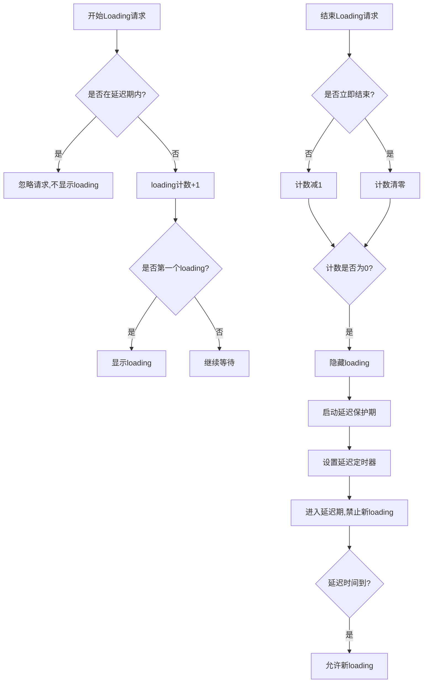

# 弹窗的封装

## 任务队列管理器

### 原理

1. **顺序执行控制**

- 确保异步任务按入队顺序执行
- 前一个任务完成后才开始下一个

2. **并发控制**

- 同一时间只执行一个任务
- 后续任务在队列中等待

```js
export class AsyncQueue {
  static create(name) {
    return new this(name);
  }

  constructor(name) {
    this.name = name;
    this.queue = [];
    this.processing = false;
  }

  async push(fun) {
    return new Promise((resolve, reject) => {
      this.queue.push({ fun, resolve, reject });
      this.process();
    });
  }

  async process() {
    if (this.processing || this.queue.length === 0) {
      return;
    }

    this.processing = true;
    const { fun, resolve, reject } = this.queue.shift();

    try {
      const result = await fun();
      resolve(result);
    } catch (error) {
      reject(error);
    } finally {
      this.processing = false;
      this.process(); // 继续处理下一个任务
    }
  }
}
```

### 场景

当触发多个弹窗时，按照触发顺序，在前一个弹窗执行完成后执行下一个弹窗。

以 uniapp 为例,先封装一个异步弹窗

```js
// utils.js

export const promiseDialog = async (dialogProps) => {
  const {
    cancelResultType = 'resolve',
    confirmResultType = 'resolve',
    onConfirm = () => 'confirm',
    onCancel = () => 'cancel',
    ...modalProps
  } = dialogProps;

  return new Promise((resolve, reject) => {
    uni.showModal({
      ...modalProps,
      success: async (res) => {
        if (res.confirm) {
          const confirmValue = await onConfirm();
          confirmResultType === 'resolve'
            ? resolve(confirmValue)
            : reject(confirmValue);
        } else if (res.cancel) {
          const cancelValue = await onCancel();
          cancelResultType === 'resolve'
            ? resolve(cancelValue)
            : reject(cancelValue);
        }
      },
    });
  });
};
```

### 使用

```js
import {promiseDialog,AsyncQueue} from '@/utils'
const asyncQueue = AsyncQueue.create();
await asyncQueue.push(() => {
  return promiseDialog({
    title: `promise-1`,
    onConfirm() {
      console.log('promise-1');
    },
  });
});
console.log('await promise-1');
for (let i = 0; i < 5; i++) {
  asyncQueue.push(() => {
    return promiseDialog({
      title: `task-${i}`,
    });
  });
  console.log(i);
}
```

## **防闪烁的延迟机制**

### 原理

1. **计数器机制**

- `loadingCount`: 跟踪当前正在进行的loading请求数量
- 避免多个请求同时控制loading状态的冲突

2. **防抖保护**

- `allowLoading`: 控制是否允许显示新的loading
- `baseDelay`: 设置防抖延迟时间
- 防止loading在短时间内频繁闪烁

3. **状态管理**

```
正常状态: allowLoading = true  → 可以显示loading
保护状态: allowLoading = false → 暂停显示loading
```




```js
export default class LoadingPanel {
  loadingCount = 0;
  baseDelay = 0;
  allowLoading = true;
  delayTimer = null;
  loadingTimeouts = new Map(); // 存储loading超时句柄
  nextId = 0; // 使用递增ID避免冲突

  constructor(delay = 0) {
    this.baseDelay = delay;
  }
    
  // 生成唯一ID
  generateId = () => {
    return `loading_${++this.nextId}`;
  };

  // 开始loading，支持超时自动清理
  addLoadingPanel = (loadingStartFn, timeout = 10000) => {
    if (!this.allowLoading) {
      return;
    }

    this.loadingCount++;
    
    if (this.loadingCount === 1) {
      loadingStartFn();
      
      // 设置超时保护，防止loading永久显示
      if (timeout > 0) {
        const loadingId = this.generateId();
        const timeoutId = setTimeout(() => {
          console.warn('Loading timeout, auto cleanup');
          this.forceCleanup();
        }, timeout);
        
        this.loadingTimeouts.set(loadingId, timeoutId);
      }
    }
  };

  // 结束loading
  decLoadingPanel = (loadingEndFn, immediately = false) => {
    if (immediately) {
      this.cleanupTimeouts();
      this.loadingCount = 0;
    } else {
      this.loadingCount = Math.max(0, this.loadingCount - 1);
    }

    if (this.loadingCount === 0) {
      loadingEndFn?.();
      this.cleanupTimeouts(); // 清理超时句柄
      this.startDelayPeriod();
    }
  };

  // 强制清理（用于超时或异常情况）
  forceCleanup = () => {
    this.loadingCount = 0;
    this.allowLoading = true;
    
    if (this.delayTimer) {
      clearTimeout(this.delayTimer);
      this.delayTimer = null;
    }
    
    this.cleanupTimeouts();
  };

  // 清理所有超时句柄
  cleanupTimeouts = () => {
    this.loadingTimeouts.forEach(timeoutId => {
      clearTimeout(timeoutId);
    });
    this.loadingTimeouts.clear();
  };

  // 启动延迟保护期
  startDelayPeriod = () => {
    if (this.baseDelay > 0) {
      this.allowLoading = false;
      
      if (this.delayTimer) {
        clearTimeout(this.delayTimer);
      }
      
      this.delayTimer = setTimeout(() => {
        this.allowLoading = true;
        this.delayTimer = null;
      }, this.baseDelay);
    }
  };
}
```

### 场景

多次连续 loading 弹窗，避免 loading 闪缩。

### 使用

```js
const loadingPanel = new LoadingPanel(1000); // 1秒防抖

// 请求开始
loadingPanel.addLoadingPanel(() => {
  showLoading(); // 显示loading UI
});

// 请求结束
loadingPanel.decLoadingPanel(() => {
  hideLoading(); // 隐藏loading UI
});
```

