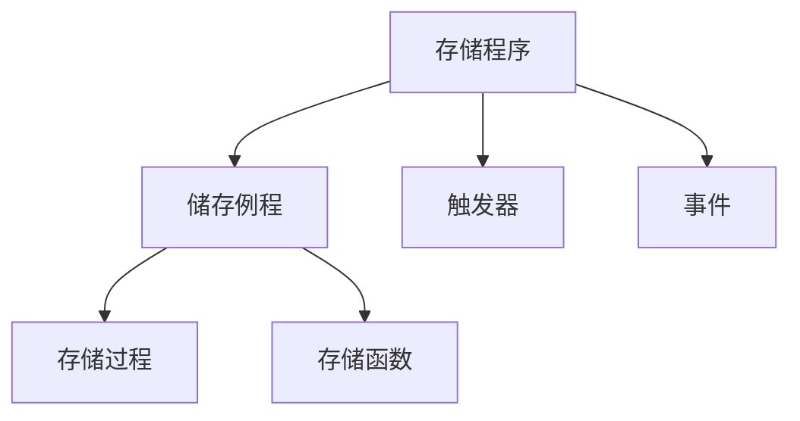
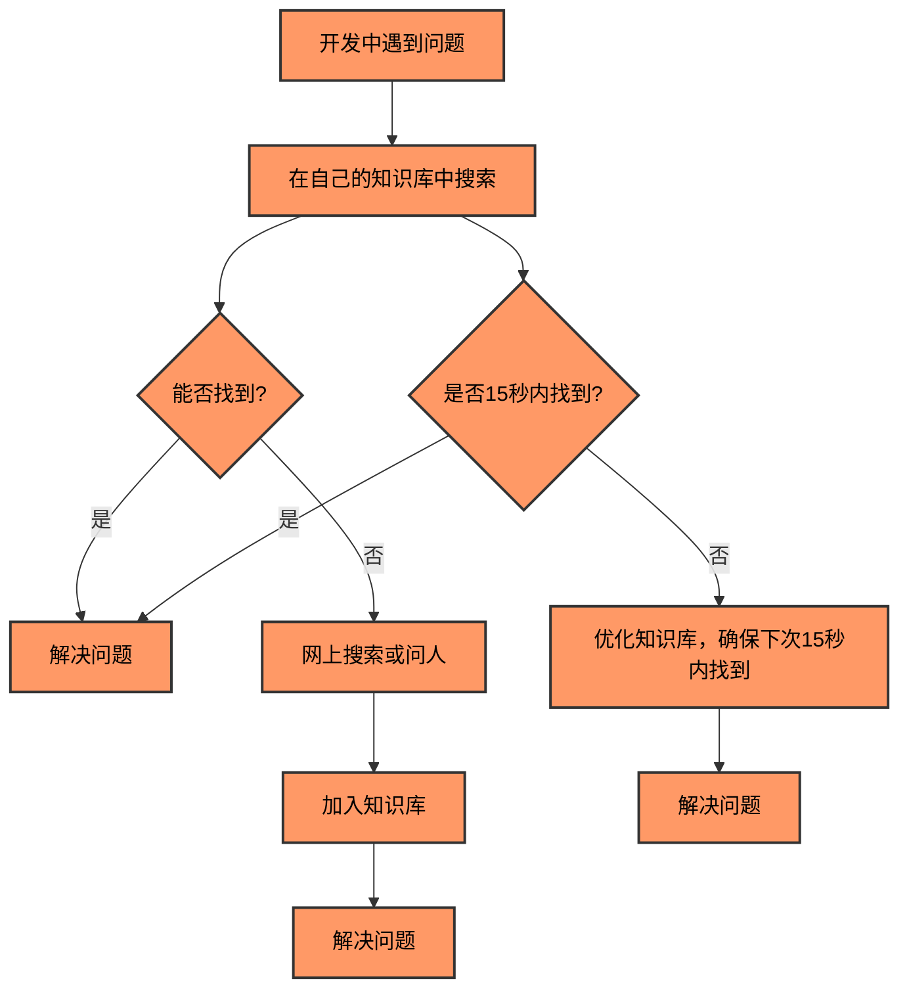

# 存储程序

在 MySQL 中，存储程序（Stored Procedures）是一组预编译的 SQL 语句，可以存储在数据库中并由应用程序或用户调用。存储程序可以提高性能、简化复杂操作，并增强安全性。

<!-- more -->

根据调用方式的不同，它还可以分为存储例程、触发器、事件这3种。并且存储例程还可以细分为存储程序、存储函数这2种。	

```mermaid
graph TD
    A[存储程序] --> B[储存例程]
    A --> C[触发器]
    A --> D[事件]
    B --> E[存储过程]
    B --> F[存储函数]
```

## 存储过程

```mermaid
graph TD
    A[开发中遇到问题] --> B[在自己的知识库中搜索]
    B --> C1{能否找到?}
    C1 -- 是 --> D[解决问题]
    C1 -- 否 --> E[网上搜索或问人]
    E --> F[加入知识库]
    F --> G[解决问题]
    B --> H{是否15秒内找到?}
    H -- 是 --> D
    H -- 否 --> I[优化知识库，确保下次15秒内找到]
    I --> J[解决问题]
    
classDef default fill:#f96,stroke:#333,stroke-width:2px,color:black;
```

