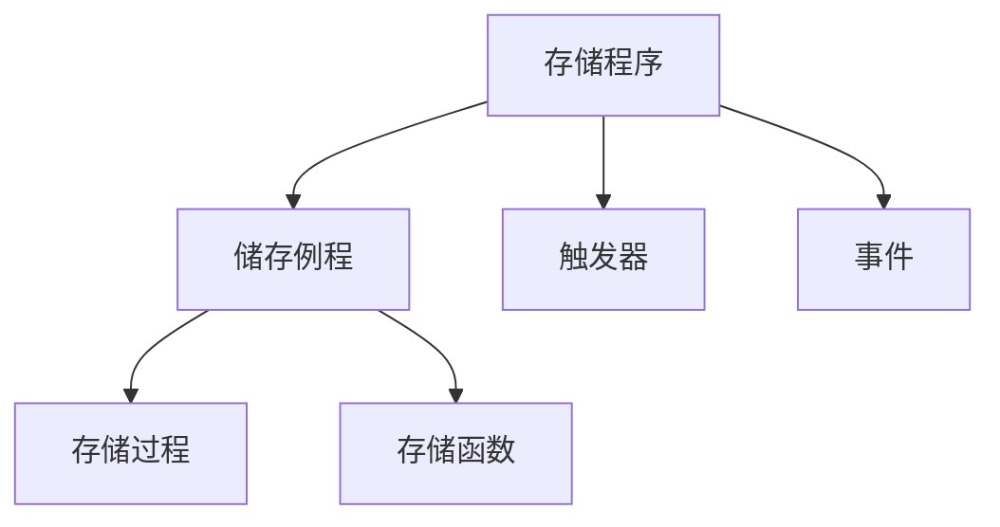

# 存储程序

在 MySQL 中，存储程序（Stored Procedures）是一组预编译的 SQL 语句，可以存储在数据库中并由应用程序或用户调用。存储程序可以提高性能、简化复杂操作，并增强安全性。

<!-- more -->

根据调用方式的不同，它还可以分为存储例程、触发器、事件这3种。并且存储例程还可以细分为存储程序、存储函数这2种。	



## 存储过程

存储过程就是用来保存一段SQL代码的。对于存储过程来说，主要学习以下4个方面的内容：

1. 创建存储过程。


2. 查看存储过程。

3. 修改存储过程。

4. 删除存储过程。

### 创建存储过程

包含一组 SQL 语句，可以接受参数并返回结果集

```sql
CREATE PROCEDURE procedure_name (参数1 类型1, …, 参数n 类型n)
BEGIN
    -- SQL statements
END
```

#### 示例

创建一个简单的存储过程来插入新水果记录。

```sql
CREATE PROCEDURE insert_fruits(IN p_name VARCHAR(50), IN p_season VARCHAR(50))
BEGIN
    INSERT INTO students (name, season) VALUES (p_name, p_season);
END 
```

调用存储过程：

```sql
CALL insert_student('草莓', '冬');
```

### 查看存储过程

在MySQL中，如果想要查看一个存储过程，我们有以下两种方式：

1. show procedure status like

2. show create procedure

#### show procedure status like

```sql
show procedure status like 存储过程名;
```

#### show create prcedure

```sql
show create procedure 存储过程名;
```

### 修改存储过程

```sql
alter procedure 存储过程名(参数1 类型1, …, 参数n 类型n)
begin
    ……
end;
```

### 删除存储过程

```sql
drop procedure 存储过程名;
```

### 存储过程

```sql
alter procedure 存储过程名()
begin
    ……
end;
```

### 删除存储过程

```sql
drop procedure 存储过程名;
```


## 存储函数

存储函数和存储过程基本是相同的，最大的不同在于：存储过程在执行之后，可以返回值也可以不返回值；而存储函数在执行之后，必须返回一个值。

### 创建存储函数

```sql
create function 存储函数名(参数1 类型1, …, 参数n 类型n) returns 返回值类型
begin
    ……
    return 返回值;
end;
```

#### 示例

创建一个函数来计算水果的平均价格

```sql
CREATE FUNCTION `calculate_average_fruits`(p_type varchar(255)) RETURNS decimal(10,2)
    DETERMINISTIC
BEGIN
    DECLARE avg_price DECIMAL(10, 2);
    SELECT AVG(price) INTO avg_price
    FROM fruits
    WHERE type = p_type;
    RETURN avg_price;
END
```

### 查看存储函数

和存储过程一样，如果想要在MySQL中查看一个存储函数，也有类似的两种方式。

```sql
-- 方式一
show function status like '存储函数名'
-- 方式二
show create function '存储函数名'
```


### 修改存储函数

```sql
alter function 存储函数名()
begin
    ……
end;
```


### 删除存储函数

```sql
drop function 存储函数名;
```


### 储存函数与存储过程的不同

1. 用途不同：存储过程是一系列SQL语句的集合，它一般涉及表的各种操作。而存储函数一般不涉及表的操作，而是完成特定的功能（比如将字符串转换为小写）。

2. 参数不同：存储过程的参数类型有int、out、inout这3种，而存储函数的参数类型类似于in参数。

3. 返回值不同：存储过程可以不返回值，也可以输出一个或多个结果集（注意这是集合）。

4. 而存储函数有且只能返回一个值（这是标量值，而不能是集合）。

5. 调用方式不同：存储过程需要使用call关键字来调用，而存储函数一般在SQL语句中调用（类似于内置函数）。

## 变量

在MySQL中，对于变量的定义，我们分为两种情况：一种是“全局变量”，另一种是“局部变量”。

### 全局变量

```sql
SET @变量名=值;
-- 或
SELECT @variable_name := value;
```

**示例**

```sql
-- 设置一个用户定义变量
SET @greeting = 'Hello, World!';

-- 查询变量值
SELECT @greeting;

-- 在查询中使用变量
SELECT @current_time := NOW();

-- 显示当前时间
SELECT @current_time;
```

### 局部变量

在MySQL中，我们也是使用set关键字来定义一个局部变量。和全局变量不同，我们必须先使用declare关键字声明了之后，才能去使用它。

```sql
-- 声明变量
declare 变量名 类型;

-- 初始化值
set 变量名 = 值;
```

### 存储过程中的变量

在存储过程中，可以声明和使用局部变量。

**示例**

```sql
CREATE PROCEDURE example_procedure()
BEGIN
    DECLARE local_var INT DEFAULT 0;
    SET local_var = 10;
    SELECT local_var AS result;
END
```

## 常用的语句

对于存储过程或存储函数来说，`begin…end`相当于函数体部分。在这个函数体中，我们可以使用以下两种语句：

1. 判断语句。

2. 循环语句。

### 判断语句

在`MySQL`中，我们可以使用`if…then…`语句来实现条件的判断。

```sql
if 判断条件 then 执行语句
elseif 判断条件 then 执行语句
    ……
else 执行语句
end if;
```

### 循环语句

除了判断语句之外，MySQL还支持循环语句。其中，循环语句有3种：①while语句；②repeat语句；③loop语句。

#### while语句

```sql
while 判断条件 do 执行的语句
end while;
```

#### repeat语句

`REPEAT ... UNTIL` 循环会反复执行一段代码块，直到指定的条件为真时才退出循环。

```sql
repeat
执行的语句
until 表达式 
end repeat;
```

#### loop语句

`LOOP` 语句用于创建一个无限循环，直到遇到 `LEAVE` 语句才会退出。`LOOP` 循环通常与条件判断结合使用，以便在满足特定条件时终止循环。

```sql
LOOP -- 开始一个无限循环
    -- 要执行的语句
    IF condition THEN
        LEAVE -- 用于退出当前循环;
    END IF;
END LOOP;
```

## 触发器

在MySQL中，触发器（trigger）指的是对表执行某一个操作时，会触发执行其他操命令的一种机制。触发器会在对表进行`insert`、`update`和`delete`这3种操作的时候被触发。

对于一个触发器来说，它被触发的时机可以分为以下两种：

1. before：在对表进行操作“之前”触发。
2. after：在对表进行操作“之后”触发。

在执行`insert`、`update`和`delete`之前的列值可以使用“old.列名”来获取，而执行这些操作之后的列值可以使用“new.列名”来获取，如下表所示

| **方式** | **说明**                 |
| -------- | ------------------------ |
| old.列名 | 获取对表操作“之前”的列值 |
| new.列名 | 获取对表操作“之后”的列值 |

根据命令的不同，有些列值可以获取，但是有些列值是不能获取的。在下表中，“√”表示可以获取，“×”表示不可以获取。

| **方式** | **执行前** | **执行后** |
| -------- | ---------- | ---------- |
| insert   | ×          | √          |
| delete   | √          | ×          |
| update   | √          | √          |

### 创建触发器

```sql
create trigger 触发器名 before 操作名
on 表名 for each row
-- 可选，指定触发器对每一行受影响的数据执行一次
FOR EACH ROW
begin
   触发器逻辑操作
end;
```

**示例**

假设我们有一个 `students` 表，并希望创建一个触发器，在插入新学生记录时自动记录日志。

```sql
-- 创建 students 表
CREATE TABLE students (
    sno INT AUTO_INCREMENT PRIMARY KEY COMMENT '学号',
    name VARCHAR(50) COMMENT '姓名',
    major VARCHAR(50) COMMENT '专业'
);

-- 插入示例数据
INSERT INTO students (name, major) VALUES ('Alice', 'Computer Science');

-- 创建 students_log 表
CREATE TABLE students_log (
    log_id INT AUTO_INCREMENT PRIMARY KEY,
    action VARCHAR(10),
    sno INT,
    name VARCHAR(50),
    major VARCHAR(50),
    log_time TIMESTAMP DEFAULT CURRENT_TIMESTAMP
);

-- 设置分隔符
DELIMITER //

-- 创建触发器 after_insert_student
CREATE TRIGGER after_insert_student
AFTER INSERT ON students
FOR EACH ROW
BEGIN
    INSERT INTO students_log (action, sno, name, major)
    VALUES ('INSERT', NEW.sno, NEW.name, NEW.major);
END //

-- 重置分隔符
DELIMITER ;

-- 插入新学生记录
INSERT INTO students (name, major) VALUES ('Bob', 'Mathematics');

-- 查询日志表
SELECT * FROM students_log;
```

:::warning 

触发器是基于一个表创建的，不过它可以用于操作多个表。

同一张表、同一触发事件、同一触发时机只能创建一个触发器。

:::

### 查看触发器

在MySQL中，我们可以使用show triggers语句来查看当前创建的触发器都有哪些。

```sql
show triggers;
```

### 删除触发器

在MySQL中，我们可以使用drop trigger语句来删除某一个触发器。

```sql
drop trigger 触发器名;
```

::: warning

MySQL并没有类似alter trigger这样的语句，因此不能像修改表、视图或存储过程那样去修改触发器。如果想要修改一个已经存在的触发器，我们可以先删除该触发器，然后再创建一个同名的触发器就可以了。

:::

## 事件

在实际开发中，有时我们想让MySQL服务器在“某个时间点”或者“每隔一段时间”自动去执行一些操作，此时可以使用事件来实现。

在MySQL中，关于事件的操作包含以下4个方面:

1. 创建事件

2. 查看事件  

3. 修改事件  

4. 删除事件

### 创建事件

在`MySQL`中，我们可以使用`create event`语句来创建一个事件（event）。对于事件来说，需要分为两种情况。

1. 在某个时间点执行。
2. 每隔一段时间执行。

#### 在某个时间点执行

```sql
create event 事件名
on schedule at 某个时间点
do
begin
    ……
end;
```

#### 每隔一段时间执行

```sql
create event 事件名
on schedule every 事件间隔
do
begin
    ……
end;
```

### 查看事件

在MySQL中，如果想要查看所创建的事件，我们有以下两种方式:

1. show events。 
2. show create event 事件名。

### 修改事件

```sql
alter event 事件名
……;
```

### 删除事件

```sql
drop event 事件名;
```

