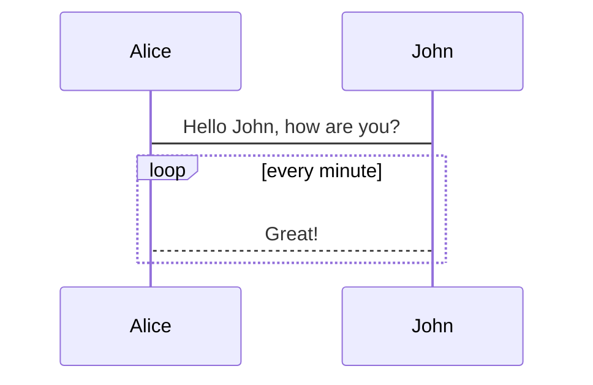

# 存储程序

在 MySQL 中，存储程序（Stored Procedures）是一组预编译的 SQL 语句，可以存储在数据库中并由应用程序或用户调用。存储程序可以提高性能、简化复杂操作，并增强安全性。

<!-- more -->

根据调用方式的不同，它还可以分为存储例程、触发器、事件这3种。并且存储例程还可以细分为存储程序、存储函数这2种。


## 存储过程


> [!NOTE]  
> Highlights information that users should take into account, even when skimming.

```math
x = {-b \pm \sqrt{b^2-4ac} \over 2a}
```




