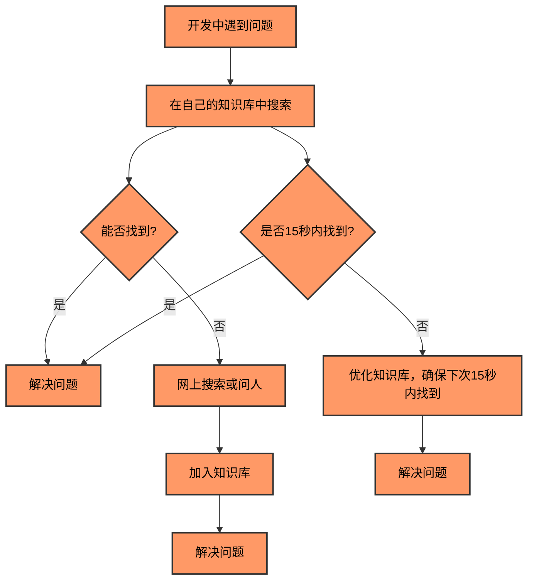
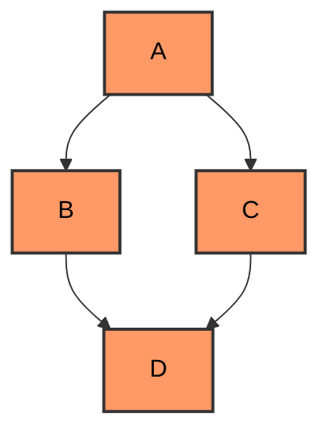
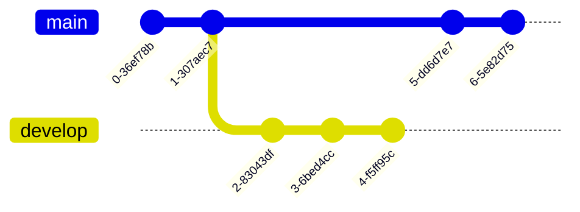
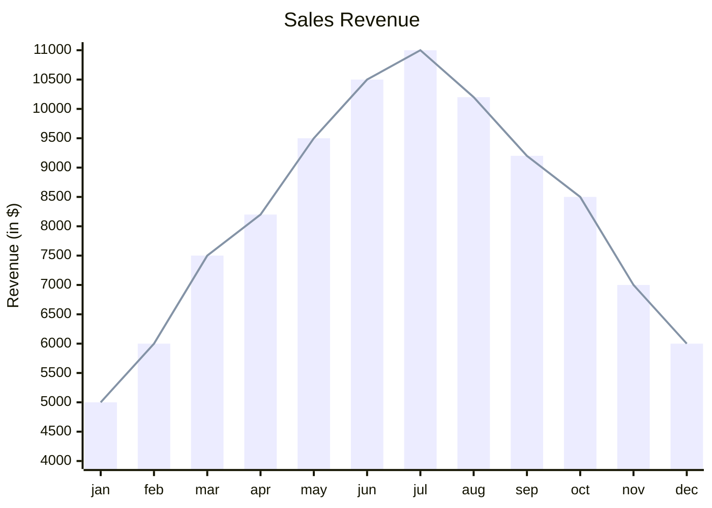

# 博客技巧

你的知识笔记枯燥无味没有重点？基于 vuepress 和 Markdown 的基本语法，配合各种骚操作，让知识笔记表现力爆棚~~

<!-- more -->

## 1. 文本高亮

使用`<mark>`标签让文本高亮

```text
这就是 &lt;mark>文本&amp;高亮&lt;/mark> 效果
```

这就是 &lt;mark>文本&amp;高亮&lt;/mark> 效果

## 2. 标记

### 内置标记

主题内置的[Badge 组件 (opens new window)](https://vuepress.vuejs.org/zh/guide/using-vue.html#badge)，直接在 Markdown 文件中使用

- **Props**:
  - `text` - string
  - `type` - string, 可选值： `"tip"|"warning"|"error"`，默认值是： `"tip"`
  - `vertical` - string, 可选值：同 [verticalAlign](https://developer.mozilla.org/zh-CN/docs/Web/CSS/vertical-align)，默认值是： `"unset"`

```html
<Badge text="beta" type="warning" /> <Badge text="内置标记" />
```

<p>版本
<Badge text="beta" type="warning"/>来自
<Badge text="内置标记"/>打上
<Badge text="注释" type="warning" vertical="top"/>
</p>

### 外部标记

使用 [shields (opens new window)](https://shields.io/)生成标记，在 Markdown 中使用

```markdown

```


> 这类标记图标可以生成动态统计数据。

## 3.自定义容器 默认主题

**输入**

```md
::: center
这是一条居中信息
:::

::: right
这是一条右对齐信息
:::

::: note
这是一条笔记
:::

::: tip
这是一个提示
:::

::: warning
这是一个警告
:::

::: danger
这是一个危险警告
:::

::: details
这是一个详情块，在 IE / Edge 中不生效
:::

::: theorem 牛顿第一定律
假若施加于某物体的外力为零，则该物体的运动速度不变。
::: right
来自 [维基百科](https://zh.wikipedia.org/wiki/%E7%89%9B%E9%A1%BF%E8%BF%90%E5%8A%A8%E5%AE%9A%E5%BE%8B)
:::
```

**输出**
::: center
这是一条居中信息
:::

::: right
这是一条右对齐信息
:::

::: note
这是一条笔记
:::

::: tip
这是一个提示
:::

::: warning
这是一个警告
:::

::: danger
这是一个危险警告
:::

::: details
这是一个详情块，在 IE / Edge 中不生效
:::

::: theorem 牛顿第一定律
假若施加于某物体的外力为零，则该物体的运动速度不变。
::: right
来自 [维基百科](https://zh.wikipedia.org/wiki/%E7%89%9B%E9%A1%BF%E8%BF%90%E5%8A%A8%E5%AE%9A%E5%BE%8B)
:::

你也可以自定义块中的标题：

```md
::: danger STOP
危险区域，禁止通行
:::

::: details 点击查看代码
```js
console.log("你好，VuePress！");
```
:::
```

::: danger STOP
危险区域，禁止通行
:::

::: details 点击查看代码

```js
console.log("你好，VuePress！");
```
:::

## 普通卡片容器

```md
::: cardList
yaml
    - name: 卡片1
      desc: 这是卡片1
      avatar: https://yemao-zi.github.io/img/heimaoio.webp # 可选
      link: https://yemao-zi.github.io/ # 可选
      bgColor: "#CBEAFA" # 可选，默认var(--bodyBg)。颜色值有#号时请添加单引号
      textColor: "#6854A1" # 可选，默认var(--textColor)
    - name: 卡片2
      desc: 这是卡片2
      avatar: https://yemao-zi.github.io/img/heimaoio.webp
      link: https://yemao-zi.github.io/
      bgColor: "#718971"
      textColor: "#fff"
    - name: 卡片3
      desc: 这是卡片3
      avatar: https://yemao-zi.github.io/img/heimaoio.webp
      link: https://yemao-zi.github.io/
      bgColor: "#FCDBA0"
      textColor: "#A05F2C"
:::
```

::: cardList
```yaml
- name: 卡片1
  desc: 这是卡片1
  avatar: https://yemao-zi.github.io/img/heimaoio.webp # 头像，可选
  link: https://yemao-zi.github.io/ # 链接，可选
  bgColor: "#CBEAFA" # 背景色，可选，默认var(--bodyBg)。颜色值有#号时请添加单引号
  textColor: "#6854A1" # 文本色，可选，默认var(--textColor)
- name: 卡片2
  desc: 这是卡片2
  avatar: https://yemao-zi.github.io/img/heimaoio.webp
  link: https://yemao-zi.github.io/
  bgColor: "#718971"
  textColor: "#fff"
- name: 卡片3
  desc: 这是卡片3
  avatar: https://yemao-zi.github.io/img/heimaoio.webp
  link: https://yemao-zi.github.io/
  bgColor: "#FCDBA0"
  textColor: "#A05F2C"
```
:::

## 图文卡片列表

```md
::: cardImgList
yaml
    config:
        target: _blank # 设置链接的打开方式，默认 _blank
        imgHeight: auto # 设置图片高度，默认 auto
        objectFit: contain # 设置图片的填充方式(object-fit)，默认 cover
        lineClamp: 1 # 描述文本超出多少行显示省略号，默认1
    data:
    - img: https://yemao-zi.github.io/img/web.png
      link: https://yemao-zi.github.io/
      name: 卡片1
      desc: 描述内容描述内容描述内容描述内容描述内容描述内容描述内容描述内容 # 描述，可选
      author: yemaozi # 作者，可选
      avatar: https://yemao-zi.github.io/img/heimaoio.webp # 头像，可选
    - img: https://yemao-zi.github.io/img/ui.png
      link: https://yemao-zi.github.io/
      name: 卡片2
      desc: 描述内容描述内容描述内容描述内容描述内容描述内容描述内容描述内容
      author: yemaozi
      avatar: https://yemao-zi.github.io/img/heimaoio.webp
    - img: https://yemao-zi.github.io/img/other.png
      link: https://yemao-zi.github.io/
      name: 卡片3
      desc: 描述内容描述内容描述内容描述内容描述内容描述内容描述内容描述内容
      author: yemaozi
      avatar: https://yemao-zi.github.io/img/heimaoio.webp
:::
```

::: cardImgList
```yaml
config:
  target: _blank # 设置链接的打开方式，默认 _blank
  imgHeight: auto # 设置图片高度，默认 auto
  objectFit: contain # 设置图片的填充方式(object-fit)，默认 cover
  lineClamp: 1 # 描述文本超出多少行显示省略号，默认1
data:
  - img: https://yemao-zi.github.io/img/web.png
    link: https://yemao-zi.github.io/
    name: 卡片1
    desc: 描述内容描述内容描述内容描述内容描述内容描述内容描述内容描述内容 # 描述，可选
    author: yemaozi # 作者，可选
    avatar: https://yemao-zi.github.io/img/heimaoio.webp # 头像，可选
  - img: https://yemao-zi.github.io/img/ui.png
    link: https://yemao-zi.github.io/
    name: 卡片2
    desc: 描述内容描述内容描述内容描述内容描述内容描述内容描述内容描述内容
    author: yemaozi
    avatar: https://yemao-zi.github.io/img/heimaoio.webp
  - img: https://yemao-zi.github.io/img/other.png
    link: https://yemao-zi.github.io/
    name: 卡片3
    desc: 描述内容描述内容描述内容描述内容描述内容描述内容描述内容描述内容
    author: yemaozi
    avatar: https://yemao-zi.github.io/img/heimaoio.webp
```
:::

## 4. 思维导图 & 流程图

### 方法一：

1. 使用[Markmap (opens new window)](https://markmap.js.org/)生成思维导图 html 文件
2. 将 html 文件放在`docs/.vuepress/public/markmap/`
3. 通过`<iframe>`插入到 Markdown

```html
<iframe
  :src="$withBase('/markmap/01.html')"
  width="100%"
  height="400"
  frameborder="0"
  scrolling="No"
  leftmargin="0"
  topmargin="0"
></iframe>
```

或者通过 markmap 生成的思维导图 html 文件通过文件转化工具（[freeconvert](https://www.freeconvert.com/zh)）转化为图片


### 方法二：

通过`<iframe>`标签引入[processon (opens new window)](https://www.processon.com/)或其他在线作图工具生成的链接。

```html
<iframe
  src="https://www.processon.com/view/link/5e718942e4b015182028682c"
  width="100%"
  height="500"
  frameborder="0"
  scrolling="No"
  leftmargin="0"
  topmargin="0"
></iframe>
```

<iframe src="https://www.processon.com/view/link/5e718942e4b015182028682c" width="100%" height="500" frameborder="0" scrolling="No" leftmargin="0" topmargin="0"></iframe>

### 方法三：

使用流程图插件：

- [vuepress-plugin-flowchart(opens new window)](https://www.npmjs.com/package/vuepress-plugin-flowchart)
- [vuepress-plugin-mermaidjs(opens new window)](https://github.com/eFrane/vuepress-plugin-mermaidjs)


### 方法四

使用 mermaid



## 5.Demo 演示框

### 方法一：

1. 安装 [vuepress-plugin-demo-block (opens new window)](https://www.npmjs.com/package/vuepress-plugin-demo-block)或其他同类插件，使用方法看插件文档
2. 在`.vuepress/config.js`配置插件
3. Markdown 中使用

> 同类插件：[vuepress-plugin-demo-container(opens new window)](https://github.com/calebman/vuepress-plugin-demo-container)

```
VanillaJs Demo:
::: demo [vanilla]
	// ...
:::
React Demo:
::: demo [react]
	// ...
:::
Vue Demo:
::: demo
	// ...
:::
```

::: demo [vanilla]

```html
<html>
  <div class="animationBox">
    <div class="rotate">旋转动画1</div>
    <div class="play">
      <div class="img">旋转动画2</div>
      <span><p class="p2"></p></span>
      <span><p></p></span>
      <span><p></p></span>
      <span><p class="p2"></p></span>
    </div>
    <div class="elasticity">弹性动画</div>
    <div class="elasticity2">曲线弹性</div>
  </div>
</html>

<style>
  .animationBox {
    overflow: hidden;
  }
  .animationBox > div {
    width: 100px;
    height: 100px;
    background: #eee;
    border-radius: 50%;
    text-align: center;
    line-height: 100px;
    margin: 30px;
    float: left;
  }
  .rotate {
    animation: rotate 5s linear infinite;
  }
  .rotate:hover {
    animation-play-state: paused;
  }
  @keyframes rotate {
    0% {
      transform: rotate(0);
    }
    100% {
      transform: rotate(360deg);
    }
  }
  .animationBox > .play {
    position: relative;
    margin: 50px 30px;
    background: none;
  }
  .play .img {
    position: absolute;
    top: 0;
    left: 0;
    z-index: 1;
    width: 100px;
    height: 100px;
    background: #eee;
    border-radius: 50%;

    animation: rotate 5s linear infinite;
  }
  .play span {
    position: absolute;
    top: 1px;
    left: 1px;
    z-index: 0;
    display: block;
    width: 96px;
    height: 96px;
    border: 1px solid #999;
    border-radius: 50%;
  }
  .play span p {
    display: block;
    width: 4px;
    height: 4px;
    background: #000;
    margin: -2px 0 0 50%;
    border-radius: 50%;
    opacity: 0.5;
  }
  .play span .p2 {
    margin: 50% 0 0 -2px;
  }
  .play span {
    animation: wave 5s linear infinite;
  }
  .play > span:nth-child(3) {
    /* 延迟时间 */
    animation-delay: 1s;
  }
  .play > span:nth-child(4) {
    animation-delay: 2.2s;
  }
  .play > span:nth-child(5) {
    animation-delay: 3.8s;
  }

  @keyframes wave {
    0% {
      transform: scale(1) rotate(360deg);
      opacity: 0.8;
    }
    100% {
      transform: scale(1.8) rotate(0deg);
      opacity: 0;
    }
  }

  .elasticity {
    /* 参数说明
      动画名称 花费时间 贝塞尔曲线 延迟开始时间 播放次数n|infinite  是否反向播放动画
    */
    animation: elasticity 1s linear 2s infinite;
  }

  @keyframes elasticity {
    0% {
      transform: scale(0);
    }
    60% {
      transform: scale(1.1);
    }
    90% {
      transform: scale(1);
    }
  }

  .elasticity2 {
    /**
    贝塞尔曲线 cubic-bezier(x1,y1,x2,y2)

    通过调整贝塞尔曲线可以设置出多种动画效果，比如反弹效果等
    X轴的范围是0~1，Y轴的取值没有规定，但是也不宜过大
    直线：linear，即cubic-bezier(0,0,1,1)

    贝塞尔曲线在线工具：https://cubic-bezier.com/#.17,.67,.83,.67
      */
    animation: elasticity2 1s cubic-bezier(0.39, 0.62, 0.74, 1.39) 2s infinite;
  }
  @keyframes elasticity2 {
    0% {
      transform: scale(0);
    }
    90% {
      transform: scale(1);
    }
  }
</style>
```

:::

### 方法二：

嵌入[codepen(opens new window)](https://codepen.io/)

<iframe height="300" style="width: 100%;" scrolling="no" title="多行展开与隐藏" src="https://codepen.io/zhushengjie123/embed/ExrWMxv?default-tab=html%2Cresult" frameborder="no" loading="lazy" allowtransparency="true" allowfullscreen="true">
  See the Pen <a href="https://codepen.io/zhushengjie123/pen/ExrWMxv">
  多行展开与隐藏</a> by Dark Cat (<a href="https://codepen.io/zhushengjie123">@zhushengjie123</a>)
  on <a href="https://codepen.io">CodePen</a>.
</iframe>

> 此外，`<iframe>`标签还可以嵌入其他任何外部网页，如视频、地图等

## 6.mermaid 图表

将代码块改为 mermaid 就可以实现 mermaid 图表

### 流程图

```md
graph TD;
A-->B;
A-->C;
B-->D;
C-->D;
```



### Git 图

```md
gitGraph
commit
commit
branch develop
commit
commit
commit
checkout main
commit
commit
```



### 坐标图

```md
xychart-beta
title "Sales Revenue"
x-axis [jan, feb, mar, apr, may, jun, jul, aug, sep, oct, nov, dec]
y-axis "Revenue (in $)" 4000 --> 11000
bar [5000, 6000, 7500, 8200, 9500, 10500, 11000, 10200, 9200, 8500, 7000, 6000]
line [5000, 6000, 7500, 8200, 9500, 10500, 11000, 10200, 9200, 8500, 7000, 6000]
```



### [更多](https://mermaid.js.org/intro/)

## 7.其他

### 添加摘要

在合适的位置添加一个`<!-- more -->`注释，前面的内容将会作为摘要在卡片中显示。

### 在线编辑文章

配置好 `Github Actions` 后，在 `Github` 源码中修改内容，或新增 `.md` 文件添加新文章，完成后提交就会自动触发 `GitHub Actions` 自动部署。

### 代码块选项卡

````vue
<code-group>
  <code-block title="YARN" active>
  ```bash
  yarn add vue -D
  ```
  </code-block>

  <code-block title="NPM">
  ```bash
  npm install vue -D
  ```
  </code-block>
</code-group>
````

<code-group>
  <code-block title="YARN" active>

```bash
yarn add vue -D
```

  </code-block>

  <code-block title="NPM">
  ```bash
  npm install vue -D
  ```
  </code-block>
</code-group>

### front matter 配置

`front matter` 是文章头部的描述信息，基于特点的规则生成博客。

```yaml
---
title: 标题
date: 2020-02-21 14:40:19
permalink: /pages/a1bc87
categories:
  - 分类1
  - 分类2
tags:
  - 标签1
sidebar: false
article: false
comment: false
editLink: false
author:
  name: 作者
  link: https://xxx.com
sticky: 1
---
```

配置项描述：

#### idebar

- `false` 不显示侧边栏
- `auto` 显示自动侧边栏（只包含本文标题和子标题）

#### article

- `false` 判定当前页面为非文章页

对于非文章页，如目录页、关于、友情链接等自定义页面，需要设置此项。设置之后这个页面将被认定为非文章页，不显示面包屑和作者、时间，不显示最近更新栏，不会参与到最近更新文章的数据计算中。

#### comment

- `false` 不显示评论区，这是[评论插件 (opens new window)](https://github.com/dongyuanxin/vuepress-plugin-comment)的一个配置

#### editLink

- `false` 不显示编辑链接

#### author

- author.name 作者名称
- author.link 作者链接

指定当前页面的作者信息，如没有作者链接时可以这样：`author: 作者名称`

#### sticky (置顶)

- 类型： `number`
- 排序：允许有多个置顶文章，按照 `1, 2, 3, ...` 来降低置顶文章的排列优先级

文章置顶，设置了此项将在首页详细版文章列表中处于置顶位置。

### 目录页配置

::: tip 注意

目录页数据需要依赖于结构化的侧边栏数据，就是说你需要在`config.js`配置 `sidebar: 'structuring'` 或 `sidebar: { mode: 'structuring', collapsable: false}` 才能实现目录页数据的获取。

:::

- 目录页(`.md`文件)可以放置在`二级目录`、`三级目录`和`四级目录`。
- 如果你不想在侧边栏显示目录页，你可以在`一级目录`中单独创建一个文件夹放置你的目录页(`.md`文件)，并在 front matter 中设置`sidebar: false`。
- 如果你想让目录页和其他页面一起出现在侧边栏，你可以和其他页面共同放置在相应的文件夹。(不要设置`sidebar: false`)
- 参照下面的示例配置好 front matter，然后就可以在导航栏或首页添加目录页链接了。

```yaml
---
pageComponent: # 使用页面组件
  name: Catalogue # 组件名：Catalogue => 目录页组件
  data: # 组件所需数据
    path: 01.学习笔记/01.前端 # 设置为`docs/`下面的某个文件夹相对路径，如‘01.学习笔记/01.前端’ 或 ’01.学习笔记‘ (有序号的要带序号)
    imgUrl: /img/web.png # 目录页内的图片
    description: JavaScript、ES6、Vue框架等前端技术 # 目录描述（可加入a标签）

title: 前端 # 页面标题
date: 2020-01-12 11:51:53 # 创建日期
permalink: /note/javascript # 永久链接
sidebar: false # 不显示侧边栏
article: false # 不是文章页 (不显示面包屑栏、最近更新栏等)
comment: false # 不显示评论栏
editLink: false # 不显示编辑按钮
---
```
