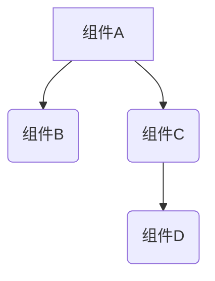

## 关于 React 渲染

 React 中的渲染和重新渲染。

- 渲染：React 让组件根据当前的 props 和 state 描述它要展示的内容。
- 重新渲染：React 让组件重新描述它要展示的内容。

要将组件显示到屏幕上，React 的工作主要分为两个阶段。

- render 阶段（渲染阶段）：计算组件的输出并收集所有需要应用到 DOM 上的变更。
- commit 阶段（提交阶段）：将 render 阶段计算出的变更应用到 DOM 上。

<!-- more -->

## 什么时候重新渲染

初始化渲染之后，下面的这些原因会让React重新渲染组件：

1. 类组件

- 调用 this.setState 方法。
- 调用this.forceUpdate方法。

2. 函数组件

- 调用 useState 返回的 setState。
- 调用 useReducer 返回的 dispatch。

3. 其他

- 组件订阅的 context value 发生变更
- 重新调用 ReactDOM.render(　`<AppRoot>`)

假设模块树如下：



默认情况，如果父组件重新渲染，那么 React 会重新渲染它所有的子组件。当用户点击组件 A 中的按钮，使 A 组件 count 状态值加1，将发生如下的渲染流程：

1. React将组件A添加到重新渲染队列中。
2. 从组件树的顶部开始遍历，快速跳过不需要更新的组件。
3. React发生A组件需要更新，它会渲染A。A返回B和C
4. B没有被标记为需要更新，但由于它的父组件A被渲染了，所以React会渲染B
5. C没有被标记为需要更新，但由于它的父组件A被渲染了，所以React会渲染C，C返回D
6. D没有标记为需要更新，但由于它的父组件C被渲染了，所以D会被渲染。

在默认渲染流程中，React 不关心子组件的 props 是否改变了，它会无条件地渲染子组件。很可能上图中大多数组件会返回与上次完全相同的结果，因此 React 不需要对DOM 做任何更改，但是，React 仍然会要求组件渲染自己并对比前后两次渲染输出的结果，这两者都需要时间。

**一道面试题**

```js
import React, { PureComponent } from 'react'

class ClassCompA extends PureComponent {
    componentDidMount() {
        console.log("111 ClassCompA componentDidMount");
    }

    componentWillUnmount() {
        console.log("222 ClassCompA componentWillUnmount");
    }

    render() {
        return (<div className="ClassCompA"></div>)
    }
}

class ClassCompB extends PureComponent {
    componentDidMount() {
        console.log("333 ClassCompB componentDidMount");
    }

    render() {
        return (<div className="ClassCompB">
            <ClassCompC />
        </div>)
    }
}


class ClassCompC extends PureComponent {
    componentDidMount() {
        console.log("444 ClassCompC componentDidMount");
    }

    render() {
        return (<div className="ClassCompC"></div>)
    }
}


export default class App extends PureComponent {
    state = {
        flag: true,
    }

    componentDidMount(){
        console.log("666 App componentDidMount");
    }

    componentDidUpdate() {
        console.log("555 App componentDidUpdate");
    }

    render() {
        return (
            <div className="wrapper">
                {this.state.flag ? <ClassCompA/> : <ClassCompB/>}
                <button onClick={() => {
                    this.setState({
                        flag: !this.state.flag
                    })
                }}>更新</button>
            </div>
        )
    }
}
```

**问：首次渲染和按下button控制台输出的顺序是什么？**

首次渲染：此时控制台打印`111`、`666`。

按下button后：控制台输出`222`、`444`、`333`、`555`。
